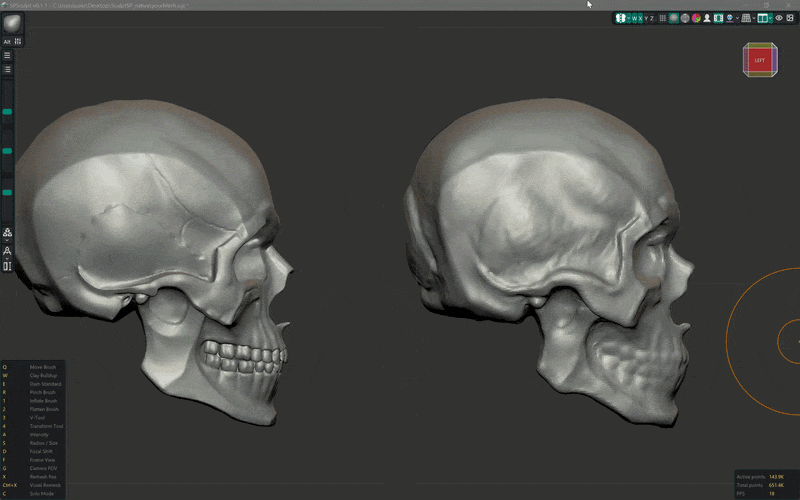

# SPSculpt

SPSculpt is a 3D sculpting desktop application written in C++.

## How to Run

1. Download the `SPSculpt_vX.X.X.zip` archive from [Releases](https://github.com/SPluzh/SPSculpt/releases).
2. Extract the contents to any convenient folder on your computer.
3. Open the extracted folder and run `SPSculpt.exe`.

## Relationship to SculptGL

SPSculpt is a native C++ port and optimization of [SculptGL](https://github.com/stephomi/sculptgl), the web-based sculpting application created by Stéphane Ginier.

### What Remains from the Original SculptGL:
* **Core Algorithms**: The mathematical formulas for the original sculpting brushes (Clay, Flatten, Smooth, Crease, Pinch, Paint, Mask, Move, Drag, Inflate, Twist, Local Scale, and Standard Brush) and stroke interpolation.
* **Mesh & Topology**: Voxel remeshing (Marching Cubes-based surface reconstruction), dynamic subdivision, decimation, octree traversal, and quad-sphere generators.
* **File Compatibility**: Native support for reading/writing SculptGL Scene (`.sgl`) files.
* **Shading Math**: Ported GLSL equations for Matcap, PBR, and Curvature rendering.

### What Was Replaced (C++ Native Version):
* **Core Tech**: 100% rewritten in **C++20** (no JS/WebGL/WASM/Emscripten remaining).
* **Window & Input**: Managed natively via **SDL2** instead of browser-based APIs.
* **User Interface**: Powered by **Dear ImGui** instead of the original lil-gui/HTML interface.
* **Performance**: Optimized with **OpenMP** multi-threading and asynchronous background workers.

