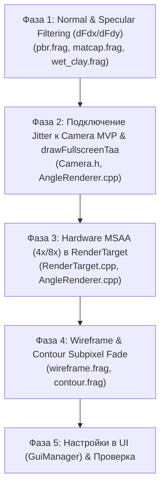

# Новый план борьбы со стробингом и "волосатостью" (Subpixel & Specular Aliasing)

## 🔍 Почему предыдущие изменения не повлияли на результат?

Анализ кода `AngleRenderer.cpp` показал ключевые причины, почему visual strobing остался:
1. **Jitter не подавался в матрицы проекции камеры:** `m_taaState.currentJitter` рассчитывался, но **не добавлялся в `uMVP` / `Camera::getProjMatrix()`** при отрисовке мешей. Геометрия растеризовалась без sub-pixel смещения.
2. **Проход TAA не вызывался:** Функция `drawFullscreenTaa()` от отсутствовала в цикле рендеринга `AngleRenderer::render()`.
3. **Спекулярный и Нормалевый алиасинг (Specular & Normal Aliasing):** При отдалении сферы субпиксельные полигоны и скачки нормалей создают "иголки" света и яркие мерцающие точки. Обычный экранный пост-процесс (FXAA) не способен убрать нормалевый шумок на микро-геометрии.

---

## 💡 Варианты решения проблемы "волосатости" и мерцания сферы при отдалении

### Вариант 1: Geometric Specular & Normal Filtering (Screen-Space Derivatives) ⭐⭐⭐⭐⭐
* **Суть:** В шейдерах PBR, Matcap и WetClay добавить коррекцию нормалей и шероховатости (Roughness modification / Normal variance) на основе экранных производных `dFdx(vNormal)` и `dFdy(vNormal)`.
* **Эффект:** Убирает "иголки" и яркие мерцающие спекулярные точки при отдалении объекта. Поверхность становится гладкой и стабильной вне зависимости от расстояния до камеры.
* **Сложность:** Низкая (~20 строк в GLSL).
* **Производительность:** Почти 0 мс затрат.

### Вариант 2: Внедрение настоящей Jitter-матрицы для TAA + History Accumulation ⭐⭐⭐⭐⭐
* **Суть:** 
  1. Передавать sub-pixel jitter непосредственно в матрицу проекции камеры `Camera::getProjMatrixWithJitter()` при геометрии-пасе.
  2. Реализовать и включить в рендер-петлю `drawFullscreenTaa()` с копированием предыдущего кадра в `m_rttTaaAccumA / B`.
* **Эффект:** Устраняет "пилу" и рваные края (волосатость силуэта) при движении и в статике.
* **Сложность:** Средняя.

### Вариант 3: Hardware MSAA 4x / 8x в Offscreen RenderTarget (GL_TEXTURE_2D_MULTISAMPLE) ⭐⭐⭐⭐
* **Суть:** Перевести основной G-Buffer / Opaque RenderTarget на мультисемплинг (`glRenderbufferStorageMultisample` / MSAA FBO) и делать `glBlitFramebuffer` (resolve pass) перед пост-обработкой.
* **Эффект:** Полная аппаратная ликвидация субпиксельной "лесенки" на краях геометрии и треугольников.
* **Сложность:** Средняя (требует обновления класса `RenderTarget`).

### Вариант 4: Subpixel Normal Smoothing Fade (Адаптивное сглаживание нормалей) ⭐⭐⭐
* **Суть:** Вычислять экранный радиус полигона/объекта в геом-шейдере или вертексном шейдере. Если размер полигона на экране $< 1.5$px, блендить нормаль с идеальной сферической нормалью или сглаживать диффузный контраст.
* **Эффект:** Полный стоп стробинга плоских и фасетных граней при удалении.
* **Сложность:** Средняя.

### Вариант 5: Screen-Space Wireframe & Overlay Distance Fade ⭐⭐⭐
* **Суть:** Если на сфере включен Wireframe или Contour Overlay, при уменьшении масштаба скрывать или делать прозрачными сетки и контуры, предотвращая муаровый узор (Moire pattern).
* **Сложность:** Низкая.

---

## 🛠️ Новый пошаговый план реализации



### Детализация задач:

#### 1. Фаза 1: Geometric Specular & Normal Filter (Приоритет 🔴 КРИТИЧЕСКИЙ)
* В `pbr.frag`, `matcap.frag`, `wet_clay.frag` вычислить вариативность нормалей:
  ```glsl
  vec3 dNdx = dFdx(vNormal);
  vec3 dNdy = dFdy(vNormal);
  float normalVariance = max(dot(dNdx, dNdx), dot(dNdy, dNdy));
  // Автоматическое увеличение Roughness для микро-деталей при отдалении:
  float roughness = clamp(uRoughness + normalVariance * 0.5, 0.0, 1.0);
  ```
* Это мгновенно уберет яркий "волосатый" пиксельный строб на сфере при отдалении.

#### 2. Фаза 2: Рабочий TAA Jitter и Resolve Pass (Приоритет 🔴 КРИТИЧЕСКИЙ)
* В `Camera.h` / `AngleRenderer.cpp` привязать `m_taaState.currentJitter` к матрице проекции `projMatrix` во время рисования меша `drawMeshSolid`.
* Реализовать тело `drawFullscreenTaa()` в `AngleRenderer.cpp` и вставить его вызов после `drawFullscreenMerge`.

#### 3. Фаза 3: Multisample FBO (Hardware MSAA 4x) (Приоритет 🟡 ВЫСОКИЙ)
* В `RenderTarget.h` / `RenderTarget.cpp` добавить поддержку MSAA (Renderbuffer с multisampling).
* Отрисовывать непрозрачную геометрию в MSAA FBO и резолвить в `m_rttOpaque`.

#### 4. Фаза 4: Fade оверлеев и Wireframe (Приоритет 🟢 СРЕДНИЙ)
* При заполнении пикселей wireframe убирать видимость тонких линий при проекции $< 1.0$ пикселя.

---

## 🎯 Ожидаемый результат после выполнения нового плана

1. **Устранение "волосатости" (иголок спекуляра):** Сфера на любом отдалении сохранит ровный гладкий блик и силуэт.
2. **Стабильный кадр при движении и отдалении:** Без мерцания и стробирования микро-полигонов.
3. **Гибкое управление в UI:** Каждую фичу (Normal Filtering, MSAA, TAA) можно независимо переключать в настройках Render Settings.