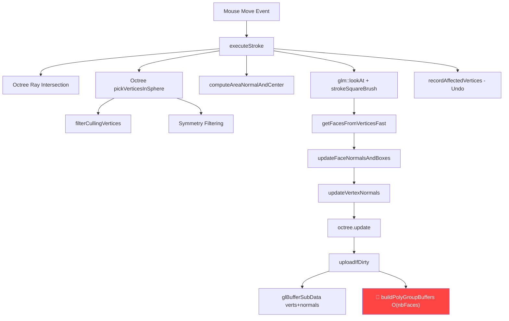

# Clay Buildup Performance Analysis & Fix Plan

## Summary of Findings

After full code review of the stroke pipeline, I've identified **multiple bottlenecks** that explain the 25 FPS drop on 300k vertices. The JS version avoids most of these by design.

---

## Architecture: What Happens Per Frame During Clay Buildup



---

## Identified Bottlenecks (Priority Order)

### 🔴 Critical: `buildPolyGroupBuffers` called every sculpt frame

**Location**: [AngleRenderer.cpp:2135-2136](file:///c:/Users/user/Desktop/cpp/sculptsp-native/src/render/AngleRenderer.cpp#L2135-L2136)

```cpp
if (bufs->polygroupVao != 0) {
    buildPolyGroupBuffers(mesh, bufs.get());  // 🔴 FULL MESH REBUILD
}
```

**Problem**: When `isVertexDirty == true` (which happens EVERY sculpt frame), this rebuilds the **entire** polygroup expanded vertex buffer for ALL faces. For 300k verts this means:
- Iterating all ~300k faces
- Allocating 6 vectors (verts, normals, materials, groups) of ~1.8M floats each
- 6 full `glBufferData` GPU uploads (~7MB total per frame)

**This happens even when PolyGroup rendering is NOT active!** The `polygroupVao != 0` check passes if polygroup buffers were ever built.

**Fix**: Skip `buildPolyGroupBuffers` unless `m_showPolyGroups` is true AND `isVertexDirty` or `isFaceGroupDirty`:

```diff
-if (bufs->polygroupVao != 0) {
-    buildPolyGroupBuffers(mesh, bufs.get());
-}
+if (bufs->polygroupVao != 0 && m_showPolyGroups) {
+    buildPolyGroupBuffers(mesh, bufs.get());
+}
```

**Expected impact**: **15-30ms savings per frame** (potentially the single biggest fix).

---

### 🟡 Medium: `computeAreaNormalAndCenter` called twice per frame

**Location**: [SculptManager.cpp:686-710](file:///c:/Users/user/Desktop/cpp/sculptsp-native/src/editing/SculptManager.cpp#L686-L710) and [SculptManager.cpp:1201-1217](file:///c:/Users/user/Desktop/cpp/sculptsp-native/src/editing/SculptManager.cpp#L1201-L1217)

For `BRUSH_CLAYBUILDUP`:
1. First call at line 1201-1217 (only on `firstStrokeFrame`)
2. Second call at line 686-710 inside `doStrokePass` (every frame when `!firstStrokeFrame`)

This is **correct** by design but adds ~0.3ms per frame. The OpenMP threshold (512 verts) is appropriate.

**Fix**: Cache the area normal/center across symmetry passes — don't recompute for each sym pass.

---

### 🟡 Medium: `updateVertexNormals` is single-threaded

**Location**: [NormalCalc.cpp:99-136](file:///c:/Users/user/Desktop/cpp/sculptsp-native/src/mesh/NormalCalc.cpp#L99-L136)

This iterates over all affected vertices and their face rings. For a large brush radius touching thousands of vertices, this can take 1-3ms.

**Fix**: Add `#pragma omp parallel for` with reduction or atomic writes:

```cpp
#pragma omp parallel for schedule(static) if(loopCount > 500)
for (int i = 0; i < loopCount; ++i) { ... }
```

---

### 🟡 Medium: `updateFaceNormalsAndBoxes` is single-threaded

**Location**: [NormalCalc.cpp:7-97](file:///c:/Users/user/Desktop/cpp/sculptsp-native/src/mesh/NormalCalc.cpp#L7-L97)

Same issue — no OpenMP parallelization for the face normal update loop.

**Fix**: Add `#pragma omp parallel for`:

```cpp
#pragma omp parallel for schedule(static) if(loopCount > 500)
for (int i = 0; i < loopCount; ++i) { ... }
```

---

### 🟡 Medium: `strokeSquareBrush` returns `nbIVerts` not `writeIdx`

**Location**: [SculptEngine.cpp:1754](file:///c:/Users/user/Desktop/cpp/sculptsp-native/src/sculpt/SculptEngine.cpp#L1754)

```cpp
return nbIVerts;  // Returns ALL vertices, not just deformed ones
```

Unlike other brushes (Inflate, Pinch etc.) that return `writeIdx` (only actually-deformed vertices), `strokeSquareBrush` returns the full input count. This means:
- `allAffectedVerts` contains ALL octree-picked vertices, not just the ones actually moved
- `getFacesFromVerticesFast`, `updateFaceNormalsAndBoxes`, `updateVertexNormals`, `octree.update` all process far more vertices/faces than needed
- The dirty range `[dirtyVertMin, dirtyVertMax]` is much wider than necessary, causing larger GPU uploads

**Fix**: Track `writeIdx` like other brushes and compact the `iVerts` array.

---

### 🟢 Minor: `std::vector` allocations in hot path

**Location**: [SculptManager.cpp:1140](file:///c:/Users/user/Desktop/cpp/sculptsp-native/src/editing/SculptManager.cpp#L1140)

```cpp
std::vector<uint32_t> pickedVertices;  // Heap allocation every frame
```

Also `allAffectedVerts`, symmetry filtering vectors, etc.

**Fix**: Use pre-allocated member vectors with `clear()` instead of stack-local `std::vector`.

---

### 🟢 Minor: `glm::inverse` on every stroke frame

**Location**: [SculptManager.cpp:724](file:///c:/Users/user/Desktop/cpp/sculptsp-native/src/editing/SculptManager.cpp#L724)

```cpp
glm::mat4 camWorld = glm::inverse(scene.getCamera().getViewMatrix());
```

Called inside `doStrokePass` which runs for each symmetry axis too.

**Fix**: Cache camera inverse matrix per frame.

---

## Proposed Fix Order

| # | Fix | Effort | Impact |
|---|-----|--------|--------|
| 1 | Skip `buildPolyGroupBuffers` when not showing polygroups | 1 line | **🔴 Huge** (~15-30ms) |
| 2 | Make `strokeSquareBrush` return actual deformed count | Small | **🟡 Medium** (~3-5ms) |
| 3 | Parallelize `updateFaceNormalsAndBoxes` | 1 line | **🟡 Medium** (~1-2ms) |
| 4 | Parallelize `updateVertexNormals` | 1 line | **🟡 Medium** (~1-2ms) |
| 5 | Reuse heap-allocated vectors | Medium | **🟢 Minor** (~0.5ms) |
| 6 | Cache camera inverse | Small | **🟢 Minor** (~0.1ms) |

---

## Profiling Strategy (If Needed)

To validate these findings before/after fixes, add timing to the critical path:

```cpp
// In executeStroke, around key sections:
auto t0 = std::chrono::high_resolution_clock::now();
// ... operation ...
auto t1 = std::chrono::high_resolution_clock::now();
double ms = std::chrono::duration<double, std::milli>(t1 - t0).count();
if (ms > 0.5) printf("[PERF] operation: %.2fms\n", ms);
```

Key sections to time:
1. `pickVerticesInSphere` — how many verts returned?
2. `doStrokePass` — brush kernel time
3. `getFacesFromVerticesFast` — (already has timing)
4. `updateFaceNormalsAndBoxes` + `updateVertexNormals`
5. `octree.update`
6. `uploadIfDirty` (especially `buildPolyGroupBuffers`)

> [!IMPORTANT]
> Fix #1 (`buildPolyGroupBuffers`) is almost certainly the dominant bottleneck. It performs a **full-mesh O(N) rebuild + 7MB GPU upload** every single frame during sculpting, regardless of whether polygroup visualization is active.

---

## Why JS Version is Faster

The JS version (WebGL):
1. **No polygroup expanded buffers** — uses flat indexed drawing, no per-face vertex expansion
2. **Partial GPU uploads** via `gl.bufferSubData` with tight dirty ranges
3. **No redundant vertex processing** — brush kernels only return deformed verts
4. **Single render pass** — Matcap shader, no shadow/SSAO/SSR (same as native with matcap, but native adds contour + bevel pre-passes)
