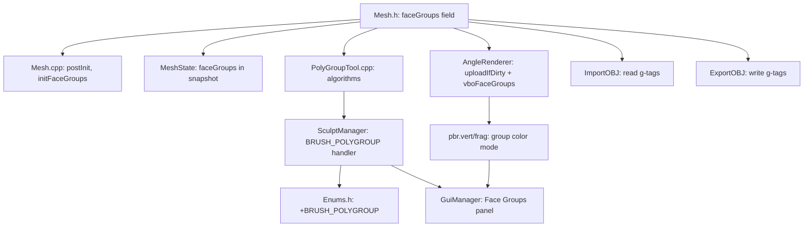

# Plan: Poly Group / Face Group System

## Обзор архитектуры

### Что такое PolyGroup?
Каждый полигон (face) принадлежит ровно одной группе, идентифицируемой **целым числом (GroupID)**. GroupID = 0 — «без группы».  
Визуально группы отображаются цветом, уникальным для каждого ID — так же, как в ZBrush.

---

## Нужны ли изменения в архитектуре?

**Да, но минимальные и органичные.** Система вписывается в существующую архитектуру без крупных переломов:

| Слой | Изменение | Объём |
|------|-----------|-------|
| `Mesh` | Добавить `vector<uint32_t> faceGroups` + грязный флаг | Малый |
| `MeshState` (undo) | Добавить `vector<uint32_t> faceGroups` | Минимальный |
| `MeshRenderBuffers` | Добавить `vboFaceGroups` (per-face → per-vertex expand) | Малый |
| `AngleRenderer` | Режим визуализации групп + шейдер | Средний |
| `SculptManager` | Новый инструмент `BRUSH_POLYGROUP` | Средний |
| `Enums.h` | +1 enum значение | Минимальный |
| `GuiManager` | Панель Face Groups | Средний |
| `ImportOBJ` | Чтение `g`-тегов → faceGroups | Малый |
| `ExportOBJ` | Запись `g`-тегов из faceGroups | Малый |

**Новых модулей не требуется** — достаточно нового файла `src/editing/PolyGroupTool.h/.cpp`.

---

## Детальный план реализации

### Фаза 1 — Данные: `Mesh` + Undo

#### 1.1 `Mesh.h` — поле групп
```cpp
// Poly Groups (одно uint32_t на полигон, 0 = no group)
std::vector<uint32_t> faceGroups;   // nbFaces * 1
bool isFaceGroupDirty = false;
```

Вспомогательные методы:
```cpp
void initFaceGroups();              // заполнить нулями
uint32_t getNextFreeGroupID() const; // max(faceGroups)+1
void setFaceGroup(uint32_t faceIdx, uint32_t gid);
```

#### 1.2 `Mesh.cpp` — реализация методов
- `initFaceGroups()` — `faceGroups.assign(nbFaces, 0)`.
- `getNextFreeGroupID()` — `*std::max_element(...) + 1`.
- Вызвать `initFaceGroups()` в `postInit()`.

#### 1.3 `MeshState` / Undo — включить в снапшот
```cpp
struct MeshState {
    // ...existing...
    std::vector<uint32_t> faceGroups;  // +новое поле
};
```

`Scene::saveCurrentState()` — скопировать `faceGroups`.  
`Scene::restoreState()` — восстановить `faceGroups`, установить `isFaceGroupDirty = true`.

---

### Фаза 2 — Рендер: GPU-буфер групп + шейдер

#### 2.1 `MeshRenderBuffers` — новый VBO
```cpp
struct MeshRenderBuffers {
    // ...existing...
    GLuint vboFaceGroups = 0;    // per-vertex uint attrib
};
```

#### 2.2 `AngleRenderer::uploadIfDirty()`
Если `mesh->isFaceGroupDirty`:
- Развернуть `faceGroups` из per-face в per-vertex (каждый полигон = 4 вершины, квады → тип `uint32_t[4]`).
- Загрузить в `vboFaceGroups` через `glBufferSubData`.
- Сбросить флаг.

> **Trick:** так как меш хранит квады, развёртка тривиальна — `vertGroupId[faceIdx*4 + {0,1,2,3}] = faceGroups[faceIdx]`.

#### 2.3 Шейдер — режим отображения групп
Новый шейдер `polygroup.vert/.frag` (или inject в `pbr.vert/frag`):

```glsl
// pbr.vert — добавить
layout(location = 5) in uint aFaceGroup;
flat out uint vFaceGroup;
// ...
vFaceGroup = aFaceGroup;
```

```glsl
// pbr.frag — добавить uniform + режим
uniform bool uShowPolyGroups;
flat in uint vFaceGroup;

// Хэш-функция GroupID → цвет
vec3 groupIdToColor(uint gid) {
    if (gid == 0u) return baseColor;
    uint h = gid * 2654435761u;
    return vec3(
        float((h >> 16) & 0xFFu) / 255.0,
        float((h >>  8) & 0xFFu) / 255.0,
        float((h      ) & 0xFFu) / 255.0
    ) * 0.7 + 0.3;
}

void main() {
    vec3 albedo = uShowPolyGroups ? groupIdToColor(vFaceGroup) : ...;
}
```

#### 2.4 `AngleRenderer` — переключатель режима
```cpp
void setShowPolyGroups(bool show) { m_showPolyGroups = show; }
bool getShowPolyGroups() const { return m_showPolyGroups; }
```

---

### Фаза 3 — Инструмент: `PolyGroupTool`

#### 3.1 Новый файл `src/editing/PolyGroupTool.h`
```cpp
class PolyGroupTool {
public:
    // Создать группу из маскированных полигонов активного меша
    void createGroupFromMask(Mesh* mesh);

    // Авто-группировка: каждый связный компонент → своя группа
    void autoGroupByConnectedComponents(Mesh* mesh);

    // Присвоить группу по клику на полигон
    void assignGroupToFace(Mesh* mesh, uint32_t faceIdx, uint32_t groupId);

    // Присвоить группу всем полигонам, связанным с кликнутым (flood fill)
    void floodFillGroup(Mesh* mesh, uint32_t startFaceIdx, uint32_t groupId);

    // Удалить все группы
    void clearAllGroups(Mesh* mesh);

    // Получить ID группы под курсором
    uint32_t getGroupAtFace(const Mesh* mesh, uint32_t faceIdx) const;

    // Сгенерировать список всех уникальных ID
    std::vector<uint32_t> getAllGroupIDs(const Mesh* mesh) const;
};
```

#### 3.2 Реализация `createGroupFromMask()`
```
Алгоритм:
1. Пройти все вершины меша
2. Вершина «маскирована», если materials[v*3+2] > 0.5 (канал маски)
3. Для каждого полигона:
   - если ВСЕ 4 вершины маскированы → назначить nextGroupID
   - иначе → оставить faceGroups[f] без изменений
4. mesh->isFaceGroupDirty = true
```

> **Порог маски** может быть настраиваемым параметром (по умолч. 0.5).

#### 3.3 Реализация `autoGroupByConnectedComponents()`
```
Алгоритм (BFS/Union-Find по топологии меша):
1. Инициализировать groupId = 0, visited[nbFaces] = false
2. Для каждого непосещённого полигона:
   a. Назначить ему новый groupId++
   b. BFS через соседние полигоны (через vertRingFace / vrfStartCount)
   c. Все связные полигоны получают тот же groupId
3. mesh->isFaceGroupDirty = true
```

Это работает для случая «объединили несколько мешей в один» (`mergeSelection()`).

#### 3.4 Реализация `floodFillGroup()`
```
То же BFS, но стартует с одного полигона и останавливается
на границах существующих групп (смена groupId = стоп).
Опционально: игнорировать границы → покрасить всё.
```

---

### Фаза 4 — Интеграция в `SculptManager`

#### 4.1 `Enums.h` — новый тип инструмента
```cpp
BRUSH_POLYGROUP,   // Вставить перед BRUSH_COUNT
```

#### 4.2 `SculptManager.h` — поле инструмента
```cpp
#include "editing/PolyGroupTool.h"
// ...
std::unique_ptr<PolyGroupTool> m_polyGroupTool;
uint32_t m_activeGroupId = 1;   // группа для назначения при клике
```

#### 4.3 `SculptManager::handleEvent()` — режим BRUSH_POLYGROUP
```
При клике ЛКМ (без Ctrl):
  - Рейкаст → faceId
  - m_polyGroupTool->assignGroupToFace(mesh, faceId, m_activeGroupId)
  - scene.pushHistoryState()

При клике ЛКМ + Ctrl:
  - Flood fill текущей группы от кликнутого полигона
  
При клике ЛКМ + Alt:
  - Пикер: m_activeGroupId = mesh->faceGroups[faceId]
```

---

### Фаза 5 — GUI: Панель Face Groups

В `GuiManager` в разделе инструментов добавить панель **"Face Groups"**:

```
┌──────────────────────────────────┐
│  🎨 Face Groups                  │
├──────────────────────────────────┤
│  [Show Groups] (Toggle)          │
├──────────────────────────────────┤
│  Active Group ID: [3] [+] [-]    │
├──────────────────────────────────┤
│  [Create from Mask]              │
│  [Auto-Group (Components)]       │
│  [Clear All Groups]              │
├──────────────────────────────────┤
│  Groups List:                    │
│  ■ Group 0 (no group) — 1240 f  │
│  ■ Group 1              — 320 f  │
│  ■ Group 2              — 840 f  │
│  [+ New Group]                   │
└──────────────────────────────────┘
```

Цветные квадраты в списке берут цвет из той же хэш-функции, что и шейдер.

---

### Фаза 6 — ZBrush OBJ совместимость

Проект уже поддерживает ZBrush-расширения OBJ (`#MRGB`, `#MAT`). Нужно добавить поддержку `g`-тегов.

#### 6.1 `ImportOBJ.cpp` — чтение `g`-тегов
```cpp
// Добавить в начало importOBJ() перед основным циклом:
uint32_t currentGroupId = 0;
std::unordered_map<std::string, uint32_t> groupNameToId;
std::vector<uint32_t> fGroupAr; // параллельно fAr, по одному на face

// В основном цикле парсинга добавить ветку:
} else if (line.rfind("g ", 0) == 0) {
    std::string groupName = line.substr(2);
    // Trim trailing whitespace
    groupName.erase(groupName.find_last_not_of(" \t\r\n") + 1);
    auto it = groupNameToId.find(groupName);
    if (it == groupNameToId.end()) {
        currentGroupId = (uint32_t)groupNameToId.size() + 1;
        groupNameToId[groupName] = currentGroupId;
    } else {
        currentGroupId = it->second;
    }
}

// При добавлении каждого face в fAr также:
fGroupAr.push_back(currentGroupId);
```

Передать `fGroupAr` в `initMeshOBJ()` и после `postInit()` присвоить:
```cpp
if (!fGroupAr.empty()) {
    mesh->faceGroups = fGroupAr;
    mesh->isFaceGroupDirty = true;
}
```

> **Примечание:** одна `f`-строка с N вершинами может порождать несколько квадов/треугольников в нашем формате. `currentGroupId` нужно push_back для каждого сгенерированного primitive в `fGroupAr`.

#### 6.2 `ExportOBJ.cpp` — запись `g`-тегов
```cpp
// В функции addMesh(), перед циклом по faces:
uint32_t prevGroup = UINT32_MAX;

for (int i = 0; i < nbFaces; ++i) {
    // Вставить смену группы перед face
    if (!mesh->faceGroups.empty() && i < (int)mesh->faceGroups.size()) {
        uint32_t gid = mesh->faceGroups[i];
        if (gid != prevGroup) {
            ss << "g polygroup_" << gid << "\n";
            prevGroup = gid;
        }
    }
    // ... существующий код вывода face ...
}
```

#### 6.3 Результат совместимости

| Сценарий | После доработки |
|----------|----------------|
| ZBrush → наш редактор (OBJ) | ✅ `g`-теги → `faceGroups` |
| Наш редактор → ZBrush (OBJ) | ✅ `faceGroups` → `g`-теги |
| ZBrush `.ZTL` / GoZ | ❌ Проприетарный формат |

---

## Граф зависимостей изменений



---

## Порядок реализации (рекомендуемый)

| № | Задача | Файл(ы) | Сложность |
|---|--------|---------|-----------|
| 1 | Добавить `faceGroups` в `Mesh` | `Mesh.h/.cpp` | 🟢 Низкая |
| 2 | Добавить в `MeshState` для Undo | `Scene.h/.cpp` | 🟢 Низкая |
| 3 | OBJ импорт: чтение `g`-тегов | `ImportOBJ.cpp` | 🟢 Низкая |
| 4 | OBJ экспорт: запись `g`-тегов | `ExportOBJ.cpp` | 🟢 Низкая |
| 5 | GPU: VBO + шейдер групп | `AngleRenderer`, `pbr.vert/.frag` | 🟡 Средняя |
| 6 | `PolyGroupTool` — базовые алгоритмы | `PolyGroupTool.h/.cpp` | 🟡 Средняя |
| 7 | `createGroupFromMask()` | `PolyGroupTool.cpp` | 🟡 Средняя |
| 8 | `autoGroupByConnectedComponents()` | `PolyGroupTool.cpp` | 🟠 Выше средней |
| 9 | `SculptManager` — новый режим | `SculptManager.cpp/.h`, `Enums.h` | 🟡 Средняя |
| 10 | GUI панель | `GuiManager.cpp` | 🟢 Низкая |

---

## Что НЕ требует изменений

- `Octree` — группы не влияют на пространственные запросы
- `Remesh` — после ремеша группы сбрасываются (`initFaceGroups()`)
- `SculptEngine` — алгоритмы лепки не знают о группах
- `NormalCalc` — группы не влияют на нормали
- Топологические структуры (`vertRingFace`, `vrfStartCount`) — только читаются

---

## Расширения (будущее, не в MVP)

| Фича | Описание |
|------|----------|
| Скрытие групп | Показывать/скрывать полигоны по GroupID (toggle visibility) |
| Маска из группы | Замаскировать всё кроме выбранной группы |
| GLB/glTF экспорт групп | Сохранять GroupID в `extras` поле через `ExportGLTF` |
| Группы + Remesh | Переносить группы после ремеша через barycentric transfer |
| Выбор групп инструментами | Лассо для назначения групп |
