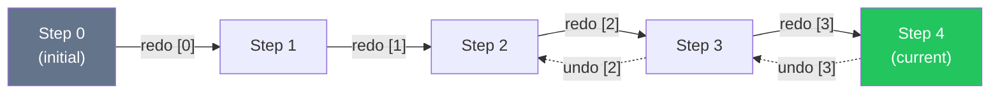

# 🎬 Sculpt Timelapse — Export from Undo History

## Концепция

Вместо записи в реальном времени — **выгружаем таймлапс из undo-истории после скульпта**. Это радикально проще:

- **0 overhead** во время скульптинга (ничего не пишем)
- Все данные **уже есть** в [UndoManager](file:///c:/Users/user/Desktop/cpp/sculptsp-native/src/editing/undo/UndoManager.h) — `m_undoStack` / `m_redoStack`
- In-app плеер с полной **перемоткой вперёд/назад**
- Рендер кадров через существующий [renderToBuffer()](file:///c:/Users/user/Desktop/cpp/sculptsp-native/src/render/AngleRenderer.h#L236)

> [!TIP]
> Undo стек содержит **ровно то, что нужно**: `SculptUndoEntry` с `VertexDelta` (indices + prevVerts + nextVerts), `TopologyUndoEntry` с полным `HistoryState` (before/after), `SceneMetaUndoEntry` с мета-данными. Таймлапс — это просто воспроизведение undo стека от начала до конца.

---

## Что уже есть в коде

| Компонент | Файл | Что даёт |
|---|---|---|
| Undo stack | [UndoManager.h:76-77](file:///c:/Users/user/Desktop/cpp/sculptsp-native/src/editing/undo/UndoManager.h#L76-L77) | `getUndoStack()` / `getRedoStack()` — `deque<unique_ptr<UndoEntry>>` |
| Sculpt delta | [SculptUndoEntry.h:8-24](file:///c:/Users/user/Desktop/cpp/sculptsp-native/src/editing/undo/SculptUndoEntry.h#L8-L24) | `indices[]`, `prevVerts[]`, `nextVerts[]`, `prevColors[]`, `nextColors[]` |
| Topology snapshot | [TopologyUndoEntry.h](file:///c:/Users/user/Desktop/cpp/sculptsp-native/src/editing/undo/TopologyUndoEntry.h) | `HistoryState before/after` — полный снимок всей сцены |
| Scene restore | [Scene.h:49](file:///c:/Users/user/Desktop/cpp/sculptsp-native/src/scene/Scene.h#L49) | `restoreState(HistoryState&)` — восстановление сцены из снимка |
| Apply entry | [UndoManager.cpp:270-343](file:///c:/Users/user/Desktop/cpp/sculptsp-native/src/editing/undo/UndoManager.cpp#L270-L343) | `applyEntry()` — применяет любой UndoEntry к сцене (undo/redo) |
| Offscreen render | [AngleRenderer.h:236](file:///c:/Users/user/Desktop/cpp/sculptsp-native/src/render/AngleRenderer.h#L236) | `renderToBuffer(scene, w, h)` → `vector<uint8_t>` RGBA |
| Dirty upload | [AngleRenderer.h:320](file:///c:/Users/user/Desktop/cpp/sculptsp-native/src/render/AngleRenderer.h#L320) | `uploadIfDirty(Mesh*)` — обновляет GPU буферы |

---

## Архитектура

```mermaid
graph TD
    subgraph "Фаза скульптинга (ничего не делаем)"
        A[Sculpting...] --> B[UndoManager accumulates entries]
    end
    
    subgraph "Фаза экспорта (после скульпта)"
        B --> C["TimelapseBuilder::buildFromHistory()"]
        C --> D[Walk undo stack: entry[0] → entry[N]]
        D --> E[TimelapseTimeline]
    end
    
    subgraph "In-App Player"
        E --> F[Timeline Slider ◀ ▮▮ ▶]
        F -->|"seek(step)"| G["Apply entries forward/backward"]
        G --> H[Update mesh + normals + octree]
        H --> I["uploadIfDirty() → render()"]
    end
    
    subgraph "Export to Video"
        F -->|"exportFrames()"| J["renderToBuffer() per step"]
        J --> K[Save PNG sequence]
        K --> L["ffmpeg → MP4/WebM"]
    end
    
    style A fill:#64748b,color:white
    style C fill:#4a9eff,color:white
    style F fill:#22c55e,color:white
    style J fill:#f59e0b,color:white
```

---

## Ключевой алгоритм: Построение Timeline из Undo Stack

### Проблема
`UndoManager` хранит entries как стек. Чтобы воспроизвести "от начала", нужно:

1. **Undo всё до самого начала** (получить начальное состояние)
2. **Redo пошагово** (каждый шаг = один "кадр" таймлапса)
3. Уметь ходить **вперёд и назад** по этому timeline

### Решение: Virtual Playback без модификации undo стека

```cpp
// TimelapseBuilder берёт snapshot undo стека, НЕ модифицирует его
class TimelapseBuilder {
public:
    struct TimelineStep {
        int entryIndex;              // Индекс в unified timeline
        UndoEntryType type;          // Sculpt / Topology / SceneMeta
        std::string description;     // "Sculpt stroke", "Voxel Remesh", etc.
    };
    
    // Строит timeline из текущего состояния UndoManager
    // 1. Копирует все entries из undoStack (это наш timeline)
    // 2. Сохраняет текущее состояние сцены как "финальный кадр"
    // 3. Делает undo-all чтобы получить "кадр 0"
    // 4. Сохраняет начальное состояние
    // 5. Восстанавливает исходное состояние (redo-all)
    bool buildFromHistory(UndoManager& undo, Scene& scene);
    
    const std::vector<TimelineStep>& getSteps() const;
    int getStepCount() const;
};
```

### Проблема с Undo Stack Ownership

> [!IMPORTANT]
> `UndoManager` хранит `unique_ptr<UndoEntry>` — их нельзя просто скопировать. Есть два решения:

#### Вариант A: Забрать стек (рекомендуемый)
```
TimelapsePlayer "забирает" весь undo/redo стек себе.
UndoManager остаётся пустым (нельзя делать undo пока плеер активен).
После закрытия плеера — стек возвращается обратно.
```

**Плюс**: Нет копирования (zero-cost), работает с любым размером истории.
**Минус**: Undo недоступен пока плеер открыт (приемлемо — это отдельный режим).

#### Вариант B: Snapshot-based
```
Перед построением таймлапса:
1. Undo всё → сохранить полный начальный HistoryState
2. Redo всё → сохранить полный финальный HistoryState  
3. Для каждого промежуточного шага — сохранить только delta
```

**Плюс**: Undo стек остаётся нетронутым.
**Минус**: Нужна память для копий (может быть большой для topology entries).

### → Выбираем **Вариант A** — забираем стек

---

## Playback Engine — навигация вперёд/назад

```cpp
class TimelapsePlayer {
public:
    enum class State { IDLE, PLAYING, PAUSED, EXPORTING };
    
    // Забирает стек из UndoManager и строит timeline
    bool open(UndoManager& undo, Scene& scene);
    
    // Закрывает плеер, возвращает стек в UndoManager
    void close(UndoManager& undo, Scene& scene);
    
    // Навигация
    void seekToStep(int step, Scene& scene);   // Прыжок к любому шагу
    void stepForward(Scene& scene);             // +1 шаг (redo)
    void stepBackward(Scene& scene);            // -1 шаг (undo)
    
    // Автовоспроизведение
    void play(float speed = 1.0f);              // Авто-play с N шагов/сек
    void pause();
    void update(float deltaTime, Scene& scene); // Вызывается из main loop
    
    // Экспорт
    void exportFrames(Scene& scene, AngleRenderer& renderer,
                      const std::string& outputDir,
                      int width, int height,
                      int stepsPerFrame = 1);   // N undo-шагов на 1 кадр
    
    // Состояние
    int getCurrentStep() const;
    int getTotalSteps() const;
    float getProgress() const;     // 0.0 — 1.0
    State getState() const;
    const std::string& getCurrentDescription() const;
    
private:
    State m_state = State::IDLE;
    int m_currentStep = 0;         // Текущая позиция в timeline
    int m_totalSteps = 0;
    float m_playSpeed = 1.0f;      // Шагов в секунду
    float m_accumTime = 0.0f;
    
    // Забранный из UndoManager стек
    std::vector<std::unique_ptr<UndoEntry>> m_timeline;
    
    // Начальное состояние сцены (step 0)
    HistoryState m_initialState;
    
    // Кеш описаний для UI
    std::vector<std::string> m_stepDescriptions;
};
```

### Навигация: как работает seek



```cpp
void TimelapsePlayer::seekToStep(int targetStep, Scene& scene) {
    targetStep = clamp(targetStep, 0, m_totalSteps);
    
    // Оптимизация: если цель близко — идём пошагово
    // Если далеко назад — restore initialState + redo до цели
    
    if (targetStep < m_currentStep) {
        // НАЗАД: undo шаги от текущего до цели
        if (m_currentStep - targetStep > targetStep) {
            // Быстрее восстановить initialState и redo вперёд
            scene.restoreState(m_initialState);
            rebuildMeshState(scene);  // normals, octree, dirty flags
            for (int i = 0; i < targetStep; ++i) {
                applyForward(m_timeline[i].get(), scene);
            }
        } else {
            // Пошаговый undo
            for (int i = m_currentStep - 1; i >= targetStep; --i) {
                applyBackward(m_timeline[i].get(), scene);
            }
        }
    } else if (targetStep > m_currentStep) {
        // ВПЕРЁД: redo шаги
        for (int i = m_currentStep; i < targetStep; ++i) {
            applyForward(m_timeline[i].get(), scene);
        }
    }
    
    m_currentStep = targetStep;
    rebuildMeshState(scene);  // Пересчитать normals, octree
}
```

> [!NOTE]
> `applyForward` / `applyBackward` — это по сути тот же код что в [UndoManager::applyEntry()](file:///c:/Users/user/Desktop/cpp/sculptsp-native/src/editing/undo/UndoManager.cpp#L270-L343), но вызванный напрямую без модификации стеков.

---

## Экспорт видео

Используем существующий [renderToBuffer()](file:///c:/Users/user/Desktop/cpp/sculptsp-native/src/render/AngleRenderer.h#L236):

```cpp
void TimelapsePlayer::exportFrames(
    Scene& scene, AngleRenderer& renderer,
    const std::string& outputDir,
    int width, int height,
    int stepsPerFrame)     // Сколько undo-шагов на один видео-кадр
{
    seekToStep(0, scene);
    
    int frameIdx = 0;
    while (m_currentStep <= m_totalSteps) {
        // 1. Обновить GPU буферы
        for (Mesh* m : scene.getMeshes()) {
            renderer.uploadIfDirty(m);
        }
        
        // 2. Рендер в буфер
        auto pixels = renderer.renderToBuffer(scene, width, height);
        
        // 3. Сохранить PNG
        std::string filename = outputDir + "/frame_" + 
                              zeroPad(frameIdx, 6) + ".png";
        savePNG(filename, pixels.data(), width, height);
        
        // 4. Шаг вперёд на N шагов
        for (int s = 0; s < stepsPerFrame && m_currentStep < m_totalSteps; ++s) {
            stepForward(scene);
        }
        frameIdx++;
    }
}
```

### Конвертация в видео
После экспорта PNG — пользователь запускает ffmpeg (или мы запускаем из приложения):
```bash
ffmpeg -framerate 30 -i frame_%06d.png -c:v libx264 -pix_fmt yuv420p timelapse.mp4
```

---

## UI — In-App Player

```
┌────────────────────────────────────────────────────────────────────┐
│                         3D Viewport                                │
│                     (рендер текущего шага)                          │
│                                                                    │
├────────────────────────────────────────────────────────────────────┤
│  ◀◀  ◀  ▮▮  ▶  ▶▶  │  Step 47 / 312  │  "Sculpt stroke"         │
│  ━━━━━━━━━●━━━━━━━━━━━━━━━━━━━━━━━━━━━━━━━━━━━━━━  │  ⬇ Export   │
│  Speed: [1x ▼]  │  Steps/frame: [3 ▼]  │  Resolution: [1920×1080] │
└────────────────────────────────────────────────────────────────────┘
```

### Элементы управления

| Кнопка | Действие |
|---|---|
| `◀◀` | Перейти к шагу 0 (начало) |
| `◀` | Шаг назад (undo 1 entry) |
| `▮▮` / `▶` | Пауза / Автовоспроизведение |
| `▶` | Шаг вперёд (redo 1 entry) |
| `▶▶` | Перейти к последнему шагу |
| Ползунок | Seek к любому шагу |
| `Speed` | Скорость автовоспроизведения (0.5x – 10x) |
| `Steps/frame` | Для экспорта: сколько undo-шагов на 1 кадр видео |
| `Export` | Экспорт PNG sequence |
| `Save .stlapse` | Сохранение записи таймлапса в файл `.stlapse` |
| `Load .stlapse` | Загрузка и открытие готового `.stlapse` файла в плеере |

---

## Формат файла `.stlapse` (Сохранение и Загрузка)

Для сохранения сессии таймлапса на диск и возможности её последующей загрузки/воспроизведения независимо от истории Undo в RAM используется специализированный контейнер **`.stlapse`**.

### Бинарная структура `.stlapse`

```
┌──────────────────────────────────────────────────────────────────────────┐
│ Header (32 bytes): Magic 'STLP', Version, Flags, StepCount, Sizes        │
├──────────────────────────────────────────────────────────────────────────┤
│ Metadata Block (JSON): Title, Author, AppVersion, Creation Date          │
├──────────────────────────────────────────────────────────────────────────┤
│ Initial Scene Snapshot: Базовое состояние сцены (HistoryState)          │
├──────────────────────────────────────────────────────────────────────────┤
│ Entry Stream:                                                            │
│   ├─ Entry Chunk 0: Type Tag (0x01 Sculpt) + Index & Delta Vectors       │
│   ├─ Entry Chunk 1: Type Tag (0x02 Topology) + Topology Snapshot        │
│   └─ Entry Chunk N: Type Tag (0x03 Meta/Camera) + Delta Data             │
└──────────────────────────────────────────────────────────────────────────┘
```

#### Поля Заголовка (Header - 32 байта)

| Смещение | Тип | Имя | Описание |
|---|---|---|---|
| `0x00` | `char[4]` | `magic` | Идентификатор файла: `'S'`, `'T'`, `'L'`, `'P'` |
| `0x04` | `uint32_t` | `version` | Версия формата (текущая: `1`) |
| `0x08` | `uint32_t` | `flags` | Флаги (0x01 = zstd compressed, 0x02 = has camera track) |
| `0x0C` | `uint32_t` | `stepCount` | Количество сохранённых шагов в timeline |
| `0x10` | `uint32_t` | `metaSize` | Размер блока метаданных (в байтах) |
| `0x14` | `uint32_t` | `initialStateSize` | Размер сжатого начального состояния сцены |
| `0x18` | `uint64_t` | `reserved` | Зарезервировано для будущих расширений |

---

### Класс сериализации `TimelapseSerializer`

```cpp
// src/timelapse/TimelapseSerializer.h
#pragma once
#include <string>
#include <vector>
#include <memory>
#include "editing/undo/UndoEntry.h"
#include "scene/Scene.h"

struct TimelapseMetadata {
    std::string title;
    std::string author;
    std::string creationDate;
    std::string appVersion;
    int totalStrokes = 0;
};

class TimelapseSerializer {
public:
    // Сохранить snapshot начального состояния и timeline шагов в файл .stlapse
    static bool saveToFile(
        const std::string& filepath,
        const HistoryState& initialState,
        const std::vector<std::unique_ptr<UndoEntry>>& timeline,
        const TimelapseMetadata& metadata = {}
    );

    // Загрузить .stlapse файл и выгрузить initial state + timeline шагов в плеер
    static bool loadFromFile(
        const std::string& filepath,
        HistoryState& outInitialState,
        std::vector<std::unique_ptr<UndoEntry>>& outTimeline,
        TimelapseMetadata& outMetadata
    );
};
```

#### Сериализация шагов (Entry Types)

1. **`SculptUndoEntry` (Tag `0x01`)**:
   - `meshIndex` (`uint32_t`)
   - `vertexCount` (`uint32_t`)
   - Массив индексов изменённых вершин (`indices[]`)
   - Дельты позиций (`prevVerts[]`, `nextVerts[]`) и опционально цветов/нормалей
2. **`TopologyUndoEntry` (Tag `0x02`)**:
   - `meshIndex` (`uint32_t`)
   - Полный сжатый snapshot топологии до и после операции (Remesh / Subdivide)
3. **`SceneMetaUndoEntry` (Tag `0x03`)**:
   - Метаинформация (изменения сцены, добавление/удаление мешей, камера)

---

## Файловая структура

```
src/timelapse/
├── TimelapsePlayer.h       — Основной класс плеера
├── TimelapsePlayer.cpp     — Навигация, seek, auto-play
├── TimelapseSerializer.h   — Сохранение и загрузка .stlapse файлов
├── TimelapseSerializer.cpp — Сериализация / Десериализация (zstd / binary)
└── TimelapseExporter.h     — Рендер кадров → PNG (header-only, простой)
```

---

## Фазы реализации

### Фаза 1: Core Player Engine (~2 дня)

**Файлы**: `src/timelapse/TimelapsePlayer.h`, `src/timelapse/TimelapsePlayer.cpp`

- [ ] `TimelapsePlayer::open()` — забирает undo стек, строит timeline, делает undo-all для получения `m_initialState`
- [ ] `TimelapsePlayer::close()` — возвращает стек в UndoManager, восстанавливает исходное состояние сцены
- [ ] `seekToStep(int step)` — навигация к любому шагу с оптимизацией (пошагово vs restore+redo)
- [ ] `stepForward()` / `stepBackward()` — пошаговая навигация
- [ ] `applyForward()` / `applyBackward()` — применение entry к сцене (извлечь из [UndoManager::applyEntry](file:///c:/Users/user/Desktop/cpp/sculptsp-native/src/editing/undo/UndoManager.cpp#L270-L343))
- [ ] `rebuildMeshState()` — пересчёт normals, faceBoxes, faceCenters, octree после изменения вершин

#### Интеграция с UndoManager

Добавить в [UndoManager.h](file:///c:/Users/user/Desktop/cpp/sculptsp-native/src/editing/undo/UndoManager.h):

```cpp
// Передать владение стеком для timelapse
std::deque<std::unique_ptr<UndoEntry>> takeUndoStack() {
    auto stack = std::move(m_undoStack);
    m_undoStack.clear();
    m_redoStack.clear();
    return stack;
}

// Вернуть стек обратно
void restoreUndoStack(std::deque<std::unique_ptr<UndoEntry>> stack) {
    m_undoStack = std::move(stack);
    m_redoStack.clear();
}
```

---

### Фаза 2: Auto-Play + Smooth Playback (~1 день)

- [ ] `play(speed)` / `pause()` — автовоспроизведение с заданной скоростью
- [ ] `update(deltaTime)` — вызов из main loop, аккумулирует время и делает step при необходимости
- [ ] Интеграция в main loop (`NativeMain.cpp` или аналог):
```cpp
// В render loop:
if (timelapsePlayer.getState() == TimelapsePlayer::State::PLAYING) {
    timelapsePlayer.update(deltaTime, scene);
    // Mesh dirty flags уже выставлены — render() подхватит
}
```

---

### Фаза 3: Сохранение и Загрузка .stlapse файлов (~1-2 дня)

**Файлы**: `src/timelapse/TimelapseSerializer.h`, `src/timelapse/TimelapseSerializer.cpp`

- [ ] Реализация `TimelapseSerializer::saveToFile()` — запись заголовка `STLP`, метаданных, `m_initialState` и дельт timeline в бинарный поток.
- [ ] Реализация `TimelapseSerializer::loadFromFile()` — чтение бинарного `.stlapse` файла, десериализация initial state и восстановления массива `m_timeline`.
- [ ] Сжатие блока данных с помощью zstd/zlib для уменьшения размера файла.
- [ ] Функция `saveTimelapse(const std::string& path)` и `loadTimelapse(const std::string& path)` в `TimelapsePlayer`.

---

### Фаза 4: Export to PNG Sequence (~1 день)

**Файл**: `src/timelapse/TimelapseExporter.h`

- [ ] `exportFrames()` — цикл: seek → `renderToBuffer()` → save PNG
- [ ] Интеграция с [stb_image_write](https://github.com/nothings/stb) для сохранения PNG (вероятно уже есть в проекте)
- [ ] Прогресс-бар в UI (callback с текущим/общим кадрами)
- [ ] Опциональный автозапуск ffmpeg для сборки видео

---

### Фаза 5: UI — Timeline Panel & File I/O (~1-2 дня)

**Интеграция в**: [GuiManager.cpp](file:///c:/Users/user/Desktop/cpp/sculptsp-native/src/gui/GuiManager.cpp)

- [ ] Панель плеера внизу экрана (ImGui)
- [ ] Timeline slider с drag и click-to-seek
- [ ] Кнопки: `|◀` `◀` `▶/▮▮` `▶` `▶|`
- [ ] Подписи: номер шага, описание операции, прогресс %
- [ ] Dropdown скорости воспроизведения
- [ ] Кнопка "Save .stlapse" — диалог сохранения таймлапса в файл
- [ ] Кнопка "Load .stlapse" — диалог открытия стороннего .stlapse файла
- [ ] Кнопка "Export" → диалог настройки (разрешение, steps/frame, путь)
- [ ] Кнопка "Open Timelapse" / "Close Timelapse"
- [ ] Блокировка инструментов скульптинга пока плеер открыт

---

## Оценка размера и производительности

### Размер в памяти
Timelapse **не занимает дополнительной памяти** — он использует тот же undo стек, который уже в RAM (до 4GB по умолчанию, настраивается через `setMaxMemory()`).

### Скорость навигации

| Операция | Время | Почему |
|---|---|---|
| `stepForward()` (SculptEntry, ~2K вершин) | **< 1 ms** | Просто записать float'ы в verts[] |
| `stepForward()` (TopologyEntry) | **5–50 ms** | `restoreState()` + пересчёт octree |
| `seekToStep()` через 100 sculpt шагов | **< 50 ms** | 100 × 1ms = 100ms worst case |
| `seekToStep(0)` из любой точки | **5–50 ms** | Один `restoreState(m_initialState)` |
| `renderToBuffer(1920×1080)` | **10–30 ms** | Зависит от сложности шейдера |
| Экспорт 1000 кадров (1080p) | **~30–60 сек** | 1000 × (seek + render + PNG save) |

### Сколько шагов в типичной сессии

| Сценарий | Undo entries | Timelapse "кадров" |
|---|---|---|
| 15 мин быстрый скетч | ~100–300 | ~100–300 |
| 1 час детальный скульпт | ~500–2000 | ~500–2000 |
| 3 часа с remesh | ~1000–5000 | ~1000–5000 |

> [!NOTE]
> При экспорте видео с `stepsPerFrame=5` и 2000 шагами получится 400 кадров → ~13 секунд видео при 30 FPS. Для более длинного таймлапса уменьшайте `stepsPerFrame` или добавьте паузы между topology-changing операциями.

---

## Ограничения и решения

### 1. Undo стек ограничен по памяти (4 GB default)
Старые entries вытесняются через `trimToMemoryLimit()`. Таймлапс будет не с самого начала.

**Решение**: Увеличить `maxMemory` перед длинной сессией, или реализовать "checkpoint save" — периодически сохранять текущий стек на диск.

### 2. Camera не сохраняется в undo entries
Undo записывает только mesh state. Камера не будет анимирована в таймлапсе.

**Решение (Фаза 5, опционально)**:
- Записывать camera state **при каждом undo entry push** в отдельный массив `vector<CameraState>`
- Или: позволить пользователю задать фиксированную камеру / орбитальную анимацию для экспорта

### 3. Topology change = тяжёлый шаг
`TopologyUndoEntry` вызывает `restoreState()` что пересчитывает всё.

**Решение**: В playback UI — автоматически группировать topology changes в один визуальный "кадр" или добавлять паузу.

---

## Резюме

| Критерий | Значение |
|---|---|
| **Подход** | Export из undo стека (post-sculpt) |
| **Overhead при скульптинге** | **Ноль** — ничего не записываем |
| **Дополнительная память** | **Ноль** — используем существующий undo стек |
| **Навигация** | Полная: вперёд, назад, seek к любому шагу |
| **Рендер** | Через существующий `renderToBuffer()` |
| **Новый код** | ~2 файла, ~500–700 строк |
| **Сложность** | Низкая-средняя (~5–6 дней) |
| **Главное преимущество** | Почти всё уже реализовано в UndoManager |
